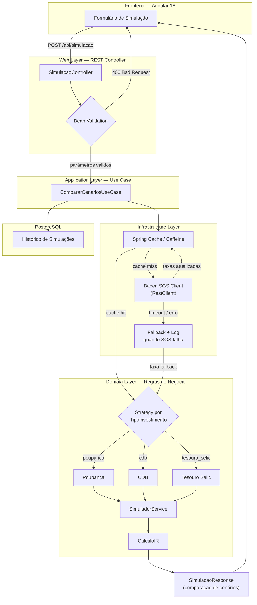

# Fluxo Geral — Request → Response

## Legenda de camadas

| Camada | Responsabilidade |
|---|---|
| **Frontend** | Coleta os parâmetros da simulação e exibe o resultado |
| **Web** | Recebe a requisição, valida o payload, delega ao use case |
| **Application** | Orquestra: busca de taxas, chamada às regras de domínio, persistência |
| **Infrastructure** | Cache local, integração com API externa (SGS), tratamento de falha |
| **Domain** | Regras de cálculo puras — sem dependência de Spring |
| **PostgreSQL** | Histórico de simulações realizadas |