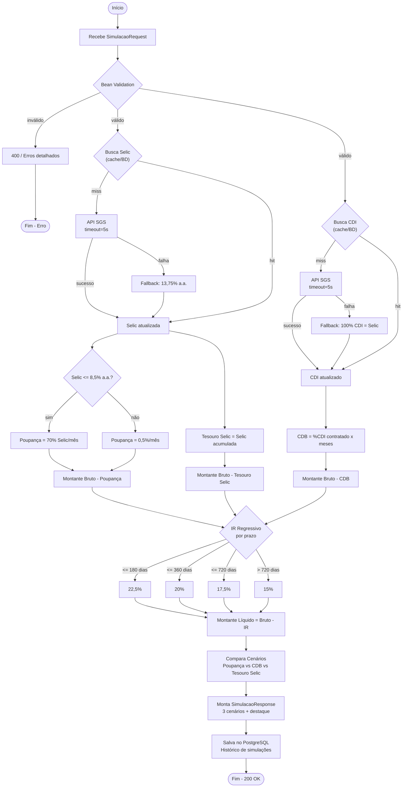

# Fluxograma de Simulação

Fluxo detalhado de processamento de uma simulação de investimento, organizado em 4 fases: **entrada/validação**, **busca de taxas**, **cálculo por cenário** e **resposta/persistência**.

> Nota: a Poupança e o Tesouro Selic dependem da taxa Selic; o CDB depende do CDI. As duas buscas rodam em paralelo logo após a validação — não há dependência entre elas.

## Tabela IR Regressivo

| Prazo | Alíquota |
|---|---|
| <= 180 dias | 22,5% |
| <= 360 dias | 20,0% |
| <= 720 dias | 17,5% |
| > 720 dias | 15,0% |

## Regras Poupança

- **Selic > 8,5% a.a.** -> rende **0,5% ao mês**
- **Selic <= 8,5% a.a.** -> rende **70% da Selic** ao mês