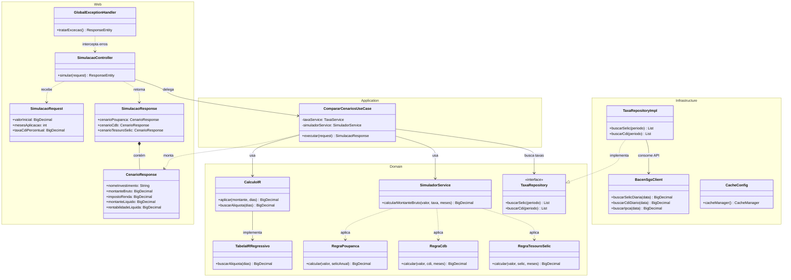

# Estrutura de Pacotes e Design Patterns

## Visão Geral das Camadas

```
Web → Application → Domain ← Infrastructure
```

- **Web**: controllers REST, DTOs, exception handler
- **Application**: use cases orquestrando lógica
- **Domain**: regras de negócio puras (sem Spring)
- **Infrastructure**: SGS client, cache, repositories

## Diagrama de Classes (agrupado por camada)



> A camada **Domain** não depende de nenhuma outra — nem de `Infrastructure`, nem de `Spring`. A dependência corre sempre em direção ao domínio (`Web → Application → Domain`), e `Infrastructure` implementa as interfaces que o `Domain` define (`TaxaRepository`), nunca o contrário. Isso é o que mantém as regras de cálculo testáveis com JUnit puro.

## Padrões Aplicados

| Padrão | Onde | Por quê |
|---|---|---|
| **Use Case** | `CompararCenariosUseCase` | Orquestração isolada de regras |
| **Strategy** | `RegraPoupanca`, `RegraCdb`, `RegraTesouroSelic` | Cada investimento tem sua lógica, fácil de adicionar novo |
| **Repository** | `TaxaRepository` + impl | Abstrai fonte de dados (SGS/BD) |
| **Adapter** | `BacenSgsClient` | Anti-corruption layer para API externa |
| **DTO** | `SimulacaoRequest/Response` | Separação entre API e domínio |
| **Fallback** | `ErrService` + cache | Resiliência quando SGS cai |
| **Global Exception Handler** | `GlobalExceptionHandler` | Tratamento centralizado de erros |